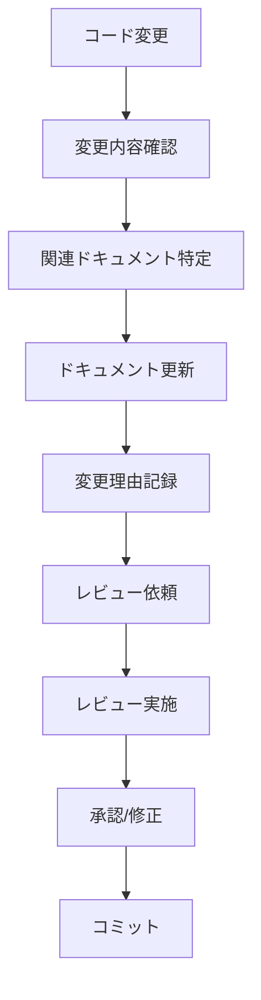

# 継続的ドキュメント更新フロー

**文書バージョン**: 1.0
**作成日**: 2025-10-17
**目的**: 開発作業中の継続的ドキュメント更新プロセスの確立

## 概要

このドキュメントは、PLMアプリケーション開発作業中に継続的にドキュメントを更新するためのフローとガイドラインを定義します。フェーズ1の実践結果に基づき、効率的なドキュメント管理体制を確立します。

## 1. ドキュメント更新原則

### 1.1 継続更新の基本原則
- **リアルタイム更新**: コード変更と同時にドキュメントを更新
- **変更追跡**: 何が・いつ・誰によって変更されたかを記録
- **レビュープロセス**: ドキュメント変更もコード変更と同様にレビュー
- **バージョン管理**: Gitでドキュメント変更を管理

### 1.2 更新責任者
- **コード変更者**: 変更内容のドキュメント更新を担当
- **レビュアー**: ドキュメント変更の正確性を確認
- **フェーズリーダー**: ドキュメント全体の一貫性を管理

## 2. ドキュメント更新タイミング

### 2.1 コード変更時の更新
```
コード変更 → 即時ドキュメント更新 → コミット
```

#### 更新対象ドキュメント
- **API仕様書**: エンドポイント追加・変更時
- **データベース設計書**: スキーマ変更時
- **画面設計書**: UI変更時
- **標準書**: 新しい知見・改善点発見時

### 2.2 フェーズ完了時の更新
```
フェーズ完了 → 実践結果反映 → 次フェーズ準備
```

#### 更新内容
- 実践で発見した課題の反映
- 標準書の改善・更新
- 新しいベストプラクティスの追加
- トラブルシューティング情報の蓄積

### 2.3 定期更新
```
日次/週次レビューポイント → 継続的改善
```

## 3. 更新ワークフロー

### 3.1 基本フロー


### 3.2 コミットメッセージの標準
```
docs: 更新内容の簡潔な説明

- 変更したファイル/セクション
- 変更理由
- 関連するIssue/PR番号

例:
docs: API仕様書の社員管理エンドポイント更新

- src/lib/trpc/routers/employee.ts の変更反映
- 新規作成・更新・削除エンドポイントの追加
- Issue #123 対応
```

### 3.3 PRテンプレートの活用
```markdown
## 変更内容
- [ ] 機能追加
- [ ] バグ修正
- [ ] ドキュメント更新

## ドキュメント更新
- [ ] 必要なし
- [ ] API仕様書の更新
- [ ] データベース設計書の更新
- [ ] 画面設計書の更新
- [ ] 標準書の更新

## レビューポイント
- ドキュメント変更の正確性
- 用語の一貫性
- 更新理由の明確性
```

## 4. ドキュメント管理体制

### 4.1 ディレクトリ構造の維持
```
docs/
├── standards/          # 開発標準書
│   ├── 001_MVP開発作業標準書.md
│   ├── 002_データベース開発作業標準書.md
│   └── 003_画面作成作業標準書.md
├── database/           # DB関連ドキュメント
├── api/               # API仕様書
├── ui/                # UI設計書
└── testing/           # テスト結果
```

### 4.2 バージョン管理
- **セマンティックバージョニング**: `v1.0.0` 形式
- **変更履歴**: 各ドキュメントに変更履歴セクション
- **互換性**: breaking changeの明示

### 4.3 品質チェックリスト
#### ドキュメント更新時
- [ ] 文法・表記揺れのチェック
- [ ] 用語の一貫性確認
- [ ] リンクの有効性確認
- [ ] コード例の動作確認
- [ ] レビュアーの承認取得

#### 定期レビュー時
- [ ] ドキュメントとコードの同期確認
- [ ] 古くなった情報の削除
- [ ] 改善提案の反映
- [ ] 検索性の向上

## 5. 実践結果の反映フロー

### 5.1 フェーズ完了時の振り返り
```markdown
## Phase X 完了報告

### 実施内容
- 完了したタスクの列挙
- 遭遇した課題
- 対応した解決策

### ドキュメント更新
- 更新したドキュメント一覧
- 追加された知見・改善点
- 新しいベストプラクティス

### 次フェーズへの示唆
- 標準書の改善提案
- 新しい手順の必要性
- 体制面の課題
```

### 5.2 標準書改善のサイクル
```
実践 → 課題発見 → 改善策立案 → 標準書更新 → 次実践
```

#### 改善の着眼点
- **効率化**: 手順の簡略化・自動化
- **品質向上**: チェックポイントの追加
- **学習性**: 新しいチームメンバーの立ち上がりを容易に

## 6. ツール・自動化

### 6.1 GitHub連携
- **PRテンプレート**: ドキュメント更新確認項目
- **ブランチ保護**: ドキュメント変更のレビュー必須
- **自動チェック**: リンターでの基本チェック

### 6.2 継続的インテグレーション
```yaml
# .github/workflows/docs-check.yml
name: Documentation Check
on:
  pull_request:
    paths:
      - 'docs/**'
jobs:
  check:
    runs-on: ubuntu-latest
    steps:
      - uses: actions/checkout@v3
      - name: Check links
        run: npx markdown-link-check docs/
      - name: Check formatting
        run: npx prettier --check docs/
```

### 6.3 自動生成ドキュメント
- **API仕様**: tRPCから自動生成
- **スキーマ図**: Prismaから自動生成
- **テスト結果**: 自動生成レポート

## 7. 教育・共有体制

### 7.1 新メンバー向け
- **ドキュメントツアー**: 新しいドキュメントの場所と役割の説明
- **更新ガイド**: いつ・何を・どのように更新するかの研修
- **メンタリング**: 最初の数回のドキュメント更新をサポート

### 7.2 チーム内共有
- **週次レビュー**: ドキュメント更新内容の共有
- **改善提案**: 継続的な改善アイデアの収集
- **ナレッジベース**: よくある質問と回答の蓄積

## 8. メトリクスと改善

### 8.1 測定指標
- **更新頻度**: コード変更に対するドキュメント更新の割合
- **レビュー時間**: ドキュメント変更のレビュー所要時間
- **正確性**: ドキュメントとコードの同期率
- **利用率**: ドキュメント参照の頻度

### 8.2 継続的改善
- **四半期レビュー**: ドキュメント管理プロセスの評価
- **改善施策**: ボトルネックの解消
- **ベストプラクティス**: 成功事例の横展開

## 9. フェーズ1の実践結果

### 9.1 実施したドキュメント更新
- **プロジェクト構成確認**: ディレクトリ構造の整理
- **バックアップ手順**: 安全な開発環境の確保
- **スキーマ分析**: Prismaスキーマの課題特定
- **標準書レビュー**: 既存標準書の改善点抽出

### 9.2 発見された課題
- **標準書の陳腐化**: 実際のプロジェクト構造との乖離
- **更新フローの未確立**: 継続的なドキュメント管理体制の欠如
- **レビュープロセスの不在**: ドキュメント変更の品質保証

### 9.3 今後の改善策
- **テンプレート化**: 更新パターンの標準化
- **自動化**: 可能な部分の自動化推進
- **教育**: チーム全体のドキュメントリテラシー向上

---

## チェックリスト

### ドキュメント更新フロー確立
- [x] 更新タイミングの定義
- [x] ワークフローの確立
- [x] 責任分担の明確化
- [x] レビュー体制の整備
- [ ] ツールの導入・設定
- [ ] 教育プログラムの準備

### 継続的改善体制
- [x] 実践結果の振り返り
- [x] 改善サイクルの確立
- [ ] メトリクスの定義
- [ ] 定期レビューのスケジュール化

このフローにより、開発作業とドキュメント更新の一体化を実現し、持続可能なドキュメント管理体制を確立します。
