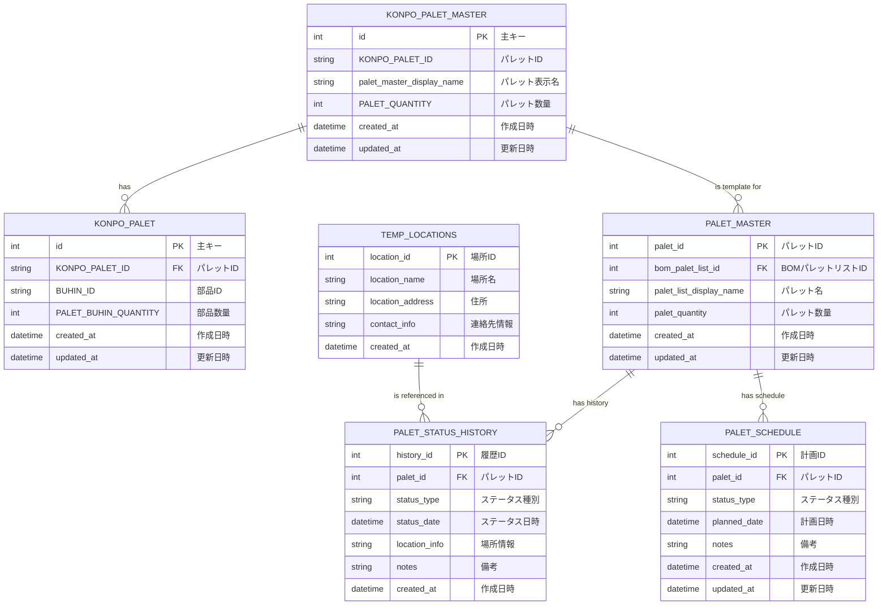

# コンポーネントパレット作成機能

[](https://nextjs.org/)
[](https://www.typescriptlang.org/)
[](https://trpc.io/)
[](https://zustand-demo.pmnd.rs/)

## 📖 概要

コンポーネントパレット作成機能は、BOM（Bill of Materials）管理システムの一部として、部品を組み合わせてパレット（コンポーネントセット）を作成・管理するNext.js 14ベースの機能です。

### 🎯 主な目的
- **部品の視覚的配置**: ドラッグ&ドロップによる直感的なパレット作成
- **パレット管理**: 作成したパレットの登録、編集、削除
- **数量管理**: 部品の数量と重量の自動計算
- **フィルタリング**: 登録済み/未登録部品の効率的な管理

## 🏗️ データベース構造

### 📊 テーブル関係図



### 📋 テーブル詳細

#### 既存テーブル

**KONPO_PALET_MASTER**（パレットマスター）
- `id`: 主キー
- `KONPO_PALET_ID`: パレットID
- `palet_master_display_name`: パレット表示名
- `PALET_QUANTITY`: パレット数量
- `created_at`, `updated_at`: タイムスタンプ

**KONPO_PALET**（部品単位のパレット情報）
- `id`: 主キー
- `KONPO_PALET_ID`: パレットID（外部キー）
- `BUHIN_ID`: 部品ID
- `PALET_BUHIN_QUANTITY`: パレット内部品数量
- `created_at`, `updated_at`: タイムスタンプ

#### 新規テーブル（出荷・工事管理用）

**PALET_MASTER**（PALET基本情報）
- `palet_id`: 主キー
- `bom_palet_list_id`: KONPO_PALET_MASTER.idへの外部キー
- `palet_list_display_name`: パレット名
- `palet_quantity`: パレット数量
- `created_at`, `updated_at`: タイムスタンプ

**PALET_STATUS_HISTORY**（ステータス履歴）
- `history_id`: 主キー
- `palet_id`: PALET_MASTER.palet_idへの外部キー
- `status_type`: ステータス種別（shipping, transit, temp_arrival, construction_start, construction_complete）
- `status_date`: ステータス日時
- `location_info`: 場所情報
- `notes`: 備考
- `created_at`: 作成日時

**PALET_SCHEDULE**（スケジュール計画）
- `schedule_id`: 主キー
- `palet_id`: PALET_MASTER.palet_idへの外部キー
- `status_type`: ステータス種別
- `planned_date`: 計画日時
- `notes`: 備考
- `created_at`, `updated_at`: タイムスタンプ

**TEMP_LOCATIONS**（仮置き場情報）
- `location_id`: 主キー
- `location_name`: 場所名
- `location_address`: 住所
- `contact_info`: 連絡先情報
- `created_at`: 作成日時

## ✨ 主な機能

### 🎨 パレット作成
- **ドラッグ&ドロップ**: 部品をパレットエリアに配置
- **リアルタイム計算**: 総数量・総重量の自動更新
- **プレビュー機能**: 作成中のパレットの視覚的確認

### 📊 パレット管理
- **登録機能**: パレット名と数量を指定してデータベースに保存
- **一覧表示**: 登録済みパレットの表示と管理
- **編集・削除**: 既存パレットの更新と削除

### 🔍 フィルタリング機能
- **登録状態フィルタ**: 登録済み/未登録/過剰登録の部品を分類
- **レイアウト切り替え**: 通常/拡張/リスト/テーブル表示の切り替え
- **検索機能**: 部品名・製造元での検索

## 🛠️ 技術スタック

### フロントエンド
- **Next.js 14**: App Routerによる最新のルーティング
- **React 18**: Concurrent FeaturesとSuspense
- **TypeScript**: 型安全性の確保
- **Tailwind CSS**: ユーティリティファーストCSS

### 状態管理
- **Zustand**: 軽量な状態管理ライブラリ
- **React Hooks**: カスタムフックによるロジック分離

### データ通信
- **tRPC**: 型安全なAPI通信
- **React Query**: サーバー状態管理

### データベース
- **SQLite**: 軽量なリレーショナルデータベース
- **tRPC**: 型安全なデータベースアクセス

## 🏗️ アーキテクチャ概要

```
┌─────────────────────────────────────────────────────────────┐
│                    Make Palet Page                          │
├─────────────────────────────────────────────────────────────┤
│  ┌─────────────┐  ┌─────────────┐  ┌─────────────┐         │
│  │   Components│  │    Hooks    │  │    Store    │         │
│  │             │  │             │  │             │         │
│  │ • MakePalet │  │ • Event     │  │ • Layout    │         │
│  │   Content   │  │   Handlers  │  │ • Filter    │         │
│  │ • Parts     │  │ • Registered│  │             │         │
│  │   Table     │  │   Quantity  │  │             │         │
│  │ • Palette   │  │             │  │             │         │
│  │   List      │  │             │  │             │         │
│  └─────────────┘  └─────────────┘  └─────────────┘         │
└─────────────────────────────────────────────────────────────┘
         │                   │                   │
         ▼                   ▼                   ▼
┌─────────────────┐  ┌─────────────────┐  ┌─────────────────┐
│   UI Layer      │  │  Business Logic │  │  State Management│
│   (React)       │  │   (Custom Hooks)│  │   (Zustand)     │
└─────────────────┘  └─────────────────┘  └─────────────────┘
         │                   │                   │
         └───────────────────┼───────────────────┘
                             │
                             ▼
                    ┌─────────────────┐
                    │   API Layer     │
                    │   (tRPC)        │
                    └─────────────────┘
                             │
                             ▼
                    ┌─────────────────┐
                    │  Database       │
                    │  (SQLite)       │
                    └─────────────────┘
```

### 設計思想

1. **コンポーネント分離**: 責務に応じた適切なコンポーネント分割
2. **カスタムフック**: ビジネスロジックの再利用可能な分離
3. **型安全性**: TypeScriptによる厳密な型定義
4. **状態管理**: Zustandによる軽量で効率的な状態管理

## 📋 ファイル構造

```
make_palet/
├── page.tsx                    # メインページコンポーネント
├── components/                 # UIコンポーネント
│   ├── MakePaletContent.tsx    # メインコンテンツ
│   ├── PartsTableWithFilter.tsx # 部品テーブル（フィルタ付き）
│   ├── PaletteList.tsx         # パレット一覧
│   ├── PaletteInfo.tsx         # パレット情報表示
│   ├── LayoutChips.tsx         # レイアウト切り替え
│   ├── PaletteRegistrationForm.tsx # パレット登録フォーム
│   ├── PaletteTable.tsx        # パレットテーブル
│   ├── PaletteCard.tsx         # パレットカード
│   ├── PartsTable.tsx          # 部品テーブル
│   └── PreviewPanel.tsx        # プレビューパネル
├── hooks/                      # カスタムフック
│   ├── usePaletEventHandlers.ts # イベントハンドラ
│   ├── useRegisteredQuantity.ts # 登録数量管理
│   └── index.ts                # エクスポート
├── types/                      # 型定義
│   ├── index.ts                # メイン型定義
│   └── parts.ts                # 部品関連型定義
├── store/                      # 状態管理
│   ├── paletLayoutStore.ts     # レイアウト状態
│   └── paletFilterStore.ts     # フィルタ状態
├── utils/                      # ユーティリティ
│   └── weightUtils.tsx         # 重量計算ユーティリティ
└── README.md                   # このファイル
```

## 📝 CREATE SQL文

### 既存テーブル
```sql
-- KONPO_PALET_MASTER（既存）
CREATE TABLE KONPO_PALET_MASTER (
    id INTEGER PRIMARY KEY AUTOINCREMENT,
    KONPO_PALET_ID VARCHAR(255) NOT NULL,
    palet_master_display_name TEXT,
    PALET_QUANTITY INTEGER DEFAULT 0,
    created_at DATETIME DEFAULT CURRENT_TIMESTAMP,
    updated_at DATETIME,
    UNIQUE(id, KONPO_PALET_ID)
);

-- KONPO_PALET（既存）
CREATE TABLE KONPO_PALET (
    id INTEGER PRIMARY KEY AUTOINCREMENT,
    KONPO_PALET_ID VARCHAR(255) NOT NULL,
    BUHIN_ID TEXT,
    PALET_BUHIN_QUANTITY INTEGER DEFAULT 0,
    created_at DATETIME DEFAULT CURRENT_TIMESTAMP,
    updated_at DATETIME,
    UNIQUE(id, KONPO_PALET_ID)
);
```

### 新規テーブル
```sql
-- PALET_MASTER
CREATE TABLE PALET_MASTER (
    palet_id INTEGER PRIMARY KEY AUTOINCREMENT,
    bom_palet_list_id INTEGER NOT NULL,
    palet_list_display_name TEXT NOT NULL,
    palet_quantity INTEGER NOT NULL DEFAULT 1,
    created_at DATETIME DEFAULT CURRENT_TIMESTAMP,
    updated_at DATETIME DEFAULT CURRENT_TIMESTAMP,
    FOREIGN KEY (bom_palet_list_id) REFERENCES KONPO_PALET_MASTER(id)
);

CREATE INDEX idx_palet_master_bom_id ON PALET_MASTER(bom_palet_list_id);

-- PALET_STATUS_HISTORY
CREATE TABLE PALET_STATUS_HISTORY (
    history_id INTEGER PRIMARY KEY AUTOINCREMENT,
    palet_id INTEGER NOT NULL,
    status_type TEXT NOT NULL CHECK (status_type IN ('shipping', 'transit', 'temp_arrival', 'construction_start', 'construction_complete')),
    status_date DATETIME NOT NULL,
    location_info TEXT,
    notes TEXT,
    created_at DATETIME DEFAULT CURRENT_TIMESTAMP,
    FOREIGN KEY (palet_id) REFERENCES PALET_MASTER(palet_id)
);

CREATE INDEX idx_status_history_palet_id ON PALET_STATUS_HISTORY(palet_id);
CREATE INDEX idx_status_history_date ON PALET_STATUS_HISTORY(status_date);
CREATE INDEX idx_status_history_type ON PALET_STATUS_HISTORY(status_type);

-- TEMP_LOCATIONS
CREATE TABLE TEMP_LOCATIONS (
    location_id INTEGER PRIMARY KEY AUTOINCREMENT,
    location_name TEXT NOT NULL,
    location_address TEXT,
    contact_info TEXT,
    created_at DATETIME DEFAULT CURRENT_TIMESTAMP
);

-- PALET_SCHEDULE
CREATE TABLE PALET_SCHEDULE (
    schedule_id INTEGER PRIMARY KEY AUTOINCREMENT,
    palet_id INTEGER NOT NULL,
    status_type TEXT NOT NULL CHECK (status_type IN ('factory_shipping', 'transit', 'temp_arrival', 'construction_start', 'construction_complete')),
    planned_date DATETIME NOT NULL,
    notes TEXT,
    created_at DATETIME DEFAULT CURRENT_TIMESTAMP,
    updated_at DATETIME DEFAULT CURRENT_TIMESTAMP,
    FOREIGN KEY (palet_id) REFERENCES PALET_MASTER(palet_id)
);

CREATE INDEX idx_schedule_palet_id ON PALET_SCHEDULE(palet_id);
CREATE INDEX idx_schedule_planned_date ON PALET_SCHEDULE(planned_date);
CREATE INDEX idx_schedule_status_type ON PALET_SCHEDULE(status_type);
```

## 📊 サンプルクエリ

### 1. **PALET詳細情報取得**
```sql
SELECT 
    pm.palet_id,
    pm.palet_list_display_name,
    pm.palet_quantity,
    kpm.palet_master_display_name,
    psh.status_type as current_status,
    psh.status_date as last_status_date,
    psh.location_info
FROM PALET_MASTER pm
LEFT JOIN KONPO_PALET_MASTER kpm ON pm.bom_palet_list_id = kpm.id
LEFT JOIN (
    SELECT palet_id, status_type, status_date, location_info
    FROM PALET_STATUS_HISTORY
    WHERE (palet_id, status_date) IN (
        SELECT palet_id, MAX(status_date)
        FROM PALET_STATUS_HISTORY
        GROUP BY palet_id
    )
) psh ON pm.palet_id = psh.palet_id
WHERE pm.palet_id = ?;
```

### 2. **ステータス別PALET数集計**
```sql
SELECT 
    status_type,
    COUNT(*) as palet_count
FROM PALET_STATUS_HISTORY psh
WHERE psh.status_date = (
    SELECT MAX(status_date)
    FROM PALET_STATUS_HISTORY
    WHERE palet_id = psh.palet_id
)
GROUP BY status_type;
```

### 3. **パレットリスト取得（JOIN）**
```sql
SELECT 
    kp.ROWID,
    kp.KONPO_PALET_ID as KONPO_PALT_ID,
    kp.BUHIN_ID as bom_buhin_id,
    kp.PALET_BUHIN_QUANTITY as bom_part_ko,
    kp.created_at,
    kp.updated_at,
    bb.ZUMEN_ID as zumen_id,
    bb.BUHIN_NAME,
    bb.BUHIN_MANUFACTURER,
    bb.BUHIN_PART_TANNI_WEIGHT,
    bb.BUHIN_QUANTITY,
    bb.BUHIN_REMARKS,
    bz.Zumen_Name as ZUMEN_NAME,
    bz.Zumen_Kind as ZUMEN_KIND,
    bz.project_ID as PROJECT_ID,
    kpl.palet_master_display_name as palet_display_name
FROM KONPO_PALET kp 
LEFT JOIN BOM_BUHIN bb ON kp.BUHIN_ID = bb.BUHIN_ID
LEFT JOIN BOM_ZUMEN bz ON bb.ZUMEN_ID = bz.Zumen_ID
LEFT JOIN KONPO_PALET_MASTER kpl ON kp.KONPO_PALET_ID = kpl.KONPO_PALET_ID
WHERE bz.project_ID = ?
ORDER BY kp.created_at DESC;
```

## 📖 使用方法

### 基本的な使い方

#### パレットの作成

```typescript
import { usePaletEventHandlers } from './hooks';

const {
  handleRegister,
  handleRemove,
  handleQtyChange,
  onDragStart,
  onDragEnd,
  onDrop
} = usePaletEventHandlers({
  palette,
  setPalette,
  // ... その他のパラメータ
});

// パレットに部品を追加
const handleAddToPalette = (part: Part) => {
  const newPaletteItem: PaletteItem = {
    ...part,
    selectedQty: 1
  };
  setPalette(prev => [...prev, newPaletteItem]);
};
```

#### パレットの登録

```typescript
// パレットをデータベースに登録
const handleRegisterPalette = async (displayName: string, quantity: number) => {
  const success = await registerPalet({
    displayName,
    items: palette,
    quantity
  });
  
  if (success) {
    console.log('パレット登録成功');
    setPalette([]); // パレットをクリア
  }
};
```

#### フィルタリング機能

```typescript
import { usePaletFilterStore } from './store/paletFilterStore';

const { filterType, setFilterType } = usePaletFilterStore();

// フィルタタイプを変更
const handleFilterChange = (newFilter: FilterType) => {
  setFilterType(newFilter);
};
```

### 設定

#### レイアウト設定

```typescript
import { usePaletLayout } from './store/paletLayoutStore';

const { layoutType, setLayoutType } = usePaletLayout();

// レイアウトタイプを変更
const handleLayoutChange = (newLayout: LayoutType) => {
  setLayoutType(newLayout);
};
```

#### 重量計算設定

```typescript
import { formatWeightJSX, formatWeightString } from './utils/weightUtils';

// 重量をフォーマット
const formattedWeight = formatWeightJSX(totalWeight);
const weightString = formatWeightString(totalWeight);
```

## 🔄 データフロー

### 1. **PALET作成フロー**
1. `KONPO_PALET_MASTER`にパレット基本情報を登録
2. `PALET_MASTER`にPALET管理用情報を登録
3. 必要に応じて`PALET_STATUS_HISTORY`に初期ステータスを登録

### 2. **ステータス更新フロー**
1. `PALET_STATUS_HISTORY`に新しいステータスを追加
2. 最新ステータスは日時順で取得

### 3. **スケジュール管理フロー**
1. `PALET_SCHEDULE`に計画を登録
2. 実際の進捗と計画を比較

### 4. **データ取得フロー**
1. `PALET_MASTER`と`KONPO_PALET_MASTER`をJOIN
2. `PALET_STATUS_HISTORY`から最新ステータスを取得
3. `PALET_SCHEDULE`から計画情報を取得
4. `TEMP_LOCATIONS`から場所情報を参照

## 🧪 テスト

### コンポーネントテスト

```bash
# 特定のコンポーネントをテスト
npm test -- MakePaletContent.test.tsx

# カバレッジレポートを生成
npm run test:coverage
```

### 型チェック

```bash
# TypeScript型チェック
npm run type-check

# ESLint実行
npm run lint
```

## 🐛 トラブルシューティング

### よくある問題

**Q: ドラッグ&ドロップが動作しない**
A: ブラウザのドラッグ&ドロップAPIが有効になっているか確認してください。

**Q: パレット登録時にエラーが発生する**
A: データベース接続とtRPCエンドポイントの状態を確認してください。

**Q: 重量計算が正しく表示されない**
A: `weightUtils.tsx`の重量フォーマット関数を確認してください。

**Q: フィルタリングが期待通りに動作しない**
A: Zustandストアの状態とフィルタロジックを確認してください。

**Q: データベーステーブルが存在しない**
A: CREATE SQL文を実行してテーブルを作成してください。

## 🔒 セキュリティ

- **データバリデーション**: tRPCスキーマによる入力値検証
- **型安全性**: TypeScriptによるコンパイル時チェック
- **エラーハンドリング**: 適切なエラー境界とフォールバックUI
- **外部キー制約**: データ整合性の確保

## 📊 パフォーマンス

- **メモ化**: `useMemo`による不要な再計算の防止
- **仮想化**: 大量データの効率的な表示
- **遅延読み込み**: 必要に応じたコンポーネントの読み込み
- **インデックス**: データベースクエリの最適化

## 🤝 貢献

### 開発ガイドライン

1. **型安全性の維持**: 新しい機能追加時は必ず型定義を更新
2. **コンポーネント分割**: 200行を超えるコンポーネントは分割を検討
3. **カスタムフック**: ビジネスロジックはカスタムフックとして分離
4. **テストカバレッジ**: 新機能には適切なテストを追加
5. **データベース設計**: 新しいテーブル追加時はpalet_management.mdを更新

### コードレビュー

- TypeScriptの型安全性を確認
- コンポーネントの責務分離を確認
- パフォーマンスへの影響を確認
- アクセシビリティの考慮を確認
- データベース設計の整合性を確認

## 📚 関連ドキュメント

- [BOM管理システム全体のREADME](../../../../README.md)
- [tRPC API仕様書](../../../../../lib/trpc/README.md)
- [型定義ガイド](../../../../../types/README.md)
- [コンポーネント設計ガイド](../../../../../components/README.md)
- [PALET管理システム設計書](../palet_management.md)

## 📞 サポート

問題や質問がある場合は、以下の方法でサポートを受けることができます：

1. **Issues**: GitHubのIssuesページで問題を報告
2. **ドキュメント**: 関連ドキュメントを参照
3. **コードレビュー**: プルリクエストでコードレビューを依頼

---

**注意**: この機能はBOM管理システムの一部として動作します。プロジェクト全体の設定とデータベース接続が必要です。データベーステーブルが存在しない場合は、上記のCREATE SQL文を実行してテーブルを作成してください。 