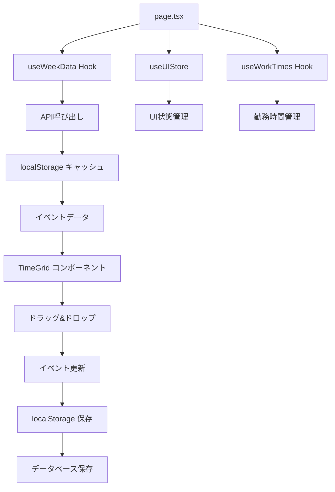

# Week Shiwake リファクタリング仕様書

## 📋 概要

このドキュメントは、`week-shiwake/[year]/[week]`フォルダのリファクタリング計画を定義します。現在の見た目を維持しつつ、データの動きと機能を整理し、保守性と拡張性を向上させます。

## 🎯 現状分析

### 現在のアーキテクチャ

```
week-shiwake/[year]/[week]/
├── page.tsx (574行) - メインコンポーネント
├── imports.ts - インポート集約
├── hooks/
│   ├── useWeekData.ts - 週データ管理
│   ├── useWorkTimes.ts - 勤務時間管理
│   └── useResizeEvent.ts - リサイズ機能
├── store/
│   └── uiStore.ts - UI状態管理
├── lib/
│   ├── client-db.ts - データベース操作
│   ├── client-storage.ts - ローカルストレージ
│   └── weekDataManager.ts - 週データ管理
├── components/
│   ├── TimeGrid.tsx - 時間グリッド
│   ├── DraggableEvent.tsx - ドラッグ可能イベント
│   ├── EventDragOverlay.tsx - ドラッグオーバーレイ
│   ├── DroppableTimeSlot.tsx - ドロップ可能スロット
│   └── sidebar/ - サイドバーコンポーネント
├── utils/
│   ├── dateUtils.ts - 日付ユーティリティ
│   ├── eventUtils.ts - イベントユーティリティ
│   ├── animationUtils.ts - アニメーション
│   ├── formatEventForClientUtils.ts - イベントフォーマット
│   └── constants.ts - 定数
└── types/
    └── event.ts - イベント型定義
```

### 主要な問題点

1. **page.tsx の肥大化** (574行)
   - 状態管理、イベントハンドラ、UIレンダリングが混在
   - 複雑なuseEffect依存関係
   - 責務の分散不足

2. **データフローの複雑性**
   - 複数の状態管理システム（useState + Zustand + localStorage）
   - API呼び出しとキャッシュ管理の分散
   - エラーハンドリングの不統一

3. **型安全性の不足**
   - `any`型の多用
   - 型定義の不完全性

## 🔄 データフロー分析

### 現在のデータフロー



### 主要なデータソース

1. **API データ**
   - `/api/achievements/week/${year}/${week}` - 週データ取得
   - 従業員情報、プロジェクト情報

2. **ローカルストレージ**
   - `week_data_${year}_${week}` - 週データキャッシュ
   - `week_changed_${year}_${week}` - 変更フラグ
   - `currentUser_projects` - プロジェクトキャッシュ

3. **Zustand Store**
   - UI状態（タブ選択、メッセージ等）

## 🎨 機能分類

### 1. データ管理機能

#### 週データ管理
- **責任**: `useWeekData` Hook
- **機能**:
  - APIからの週データ取得
  - ローカルストレージキャッシュ
  - エラーハンドリング
  - データフォーマット変換

#### 勤務時間管理
- **責任**: `useWorkTimes` Hook
- **機能**:
  - 勤務時間の取得・保存
  - デフォルト設定の管理
  - 曜日別設定

#### イベント管理
- **責任**: 新しい `useEventManager` Hook
- **機能**:
  - イベントの作成・更新・削除
  - ドラッグ&ドロップ処理
  - イベントのコピー機能

### 2. UI状態管理機能

#### グローバルUI状態
- **責任**: `useUIStore` (Zustand)
- **機能**:
  - タブ選択状態
  - メッセージ表示
  - エラー状態

#### ローカルUI状態
- **責任**: 各コンポーネント
- **機能**:
  - 選択状態
  - ドラッグ状態
  - ローディング状態

### 3. ユーザーインタラクション機能

#### ドラッグ&ドロップ
- **責任**: `TimeGrid` + `DraggableEvent`
- **機能**:
  - イベントの移動
  - Ctrl+ドラッグでのコピー
  - リサイズ機能

#### イベント操作
- **責任**: `WeekSidebar`
- **機能**:
  - イベント詳細表示
  - イベント編集
  - イベント削除

### 4. データ永続化機能

#### 自動保存
- **責任**: `weekDataManager`
- **機能**:
  - 変更検知
  - 自動保存
  - 離脱時の保存

#### 手動保存
- **責任**: ユーザーアクション
- **機能**:
  - 明示的な保存
  - 保存確認

## 🔧 リファクタリング計画

### Phase 1: カスタムフックの整理

#### 1.1 `useWeekShiwake` メインフックの作成

```typescript
// hooks/useWeekShiwake.ts
export const useWeekShiwake = () => {
  // 週データ管理
  const weekData = useWeekData();
  
  // イベント管理
  const eventManager = useEventManager();
  
  // 勤務時間管理
  const workTimes = useWorkTimes();
  
  // UI状態管理
  const uiState = useUIStore();
  
  return {
    ...weekData,
    ...eventManager,
    ...workTimes,
    ...uiState
  };
};
```

#### 1.2 `useEventManager` の新規作成

```typescript
// hooks/useEventManager.ts
export const useEventManager = () => {
  // イベントの作成・更新・削除
  // ドラッグ&ドロップ処理
  // イベントのコピー機能
};
```

### Phase 2: 状態管理の統合

#### 2.1 Zustand Store の拡張

```typescript
// store/weekShiwakeStore.ts
interface WeekShiwakeState {
  // 週データ
  events: EventItem[];
  employees: Employee[];
  projects: Project[];
  currentUser: User;
  
  // UI状態
  selectedEvent: EventItem | null;
  activeEvent: EventItem | null;
  isSaving: boolean;
  hasChanges: boolean;
  
  // アクション
  setEvents: (events: EventItem[]) => void;
  updateEvent: (event: EventItem) => void;
  deleteEvent: (id: string) => void;
  // ... その他のアクション
}
```

#### 2.2 型定義の強化

```typescript
// types/index.ts
export interface WeekShiwakeState {
  // 厳密な型定義
}

export interface EventManager {
  // イベント管理の型定義
}

export interface DataManager {
  // データ管理の型定義
}
```

### Phase 3: コンポーネントの分割

#### 3.1 ページコンポーネントの簡素化

```typescript
// page.tsx (簡素化版)
export default function WeekShiwakePage() {
  const {
    loading,
    events,
    handleEventClick,
    handleTimeSlotClick,
    // ... その他の機能
  } = useWeekShiwake();

  if (loading) return <LoadingSpinner />;

  return (
    <div className="p-4">
      <ErrorBoundary>
        <WeekShiwakeLayout>
          <TimeGrid />
          <WeekSidebar />
        </WeekShiwakeLayout>
      </ErrorBoundary>
    </div>
  );
}
```

#### 3.2 機能別コンポーネントの作成

```typescript
// components/WeekShiwakeLayout.tsx
// components/ErrorBoundary.tsx
// components/LoadingSpinner.tsx
// components/WeekShiwakeProvider.tsx
```

### Phase 4: ユーティリティの整理

#### 4.1 定数の集約

```typescript
// constants/index.ts
export const TIME_SLOT_HEIGHT = 64;
export const FIFTEEN_MIN_HEIGHT = 16;
export const EVENT_CATEGORY_COLORS = {
  // カテゴリ別色定義
};
```

#### 4.2 API クライアントの抽象化

```typescript
// lib/apiClient.ts
export class WeekShiwakeAPI {
  static async getWeekData(year: number, week: number): Promise<WeekData>
  static async saveWeekData(year: number, week: number, data: WeekData): Promise<void>
  static async deleteEvent(id: string): Promise<void>
  // ... その他のAPI呼び出し
}
```

## 📊 改善効果

### 保守性の向上
- **コードの可読性**: 機能別の分割により、各ファイルの責務が明確
- **デバッグの容易さ**: エラーの発生箇所の特定が容易
- **テストの書きやすさ**: 各機能が独立しているため、単体テストが書きやすい

### 拡張性の向上
- **新機能の追加**: 新しいフックやコンポーネントの追加が容易
- **既存機能の修正**: 特定の機能のみを修正可能
- **再利用性**: 他のページでも同じフックやコンポーネントを再利用可能

### パフォーマンスの向上
- **不要な再レンダリングの削減**: 状態管理の最適化
- **メモリ使用量の削減**: 適切なクリーンアップ処理
- **バンドルサイズの最適化**: 不要な依存関係の削除

## 🚀 実装優先順位

### 高優先度
1. **`useWeekShiwake` メインフックの作成**
2. **型定義の強化**
3. **page.tsx の簡素化**

### 中優先度
4. **Zustand Store の拡張**
5. **API クライアントの抽象化**
6. **エラーハンドリングの統一**

### 低優先度
7. **コンポーネントの細分化**
8. **テストの追加**
9. **ドキュメントの整備**

## 📝 注意事項

1. **既存の見た目を維持**: UIの変更は最小限に留める
2. **段階的な移行**: 一度に全てを変更せず、段階的に移行
3. **後方互換性**: 既存のAPIやデータ構造との互換性を保つ
4. **エラーハンドリング**: 各段階で適切なエラーハンドリングを実装

## 🔍 次のステップ

1. **詳細設計**: 各フックやコンポーネントの詳細設計
2. **実装計画**: 段階的な実装計画の策定
3. **テスト計画**: 各機能のテスト計画の策定
4. **移行計画**: 既存コードから新コードへの移行計画

この仕様書に基づいて、段階的にリファクタリングを進めることで、保守性と拡張性の高いコードベースを構築できます。 