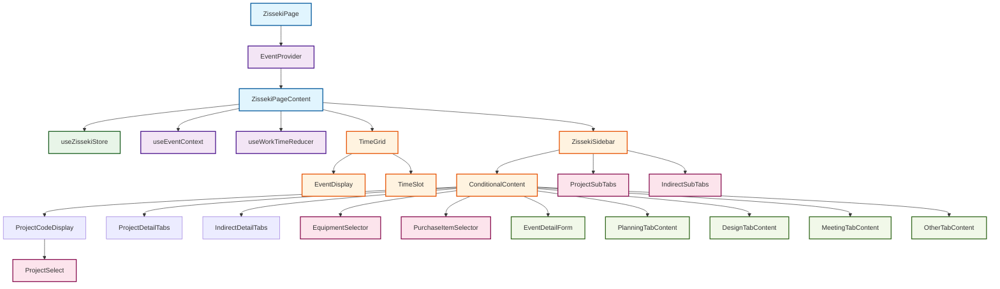
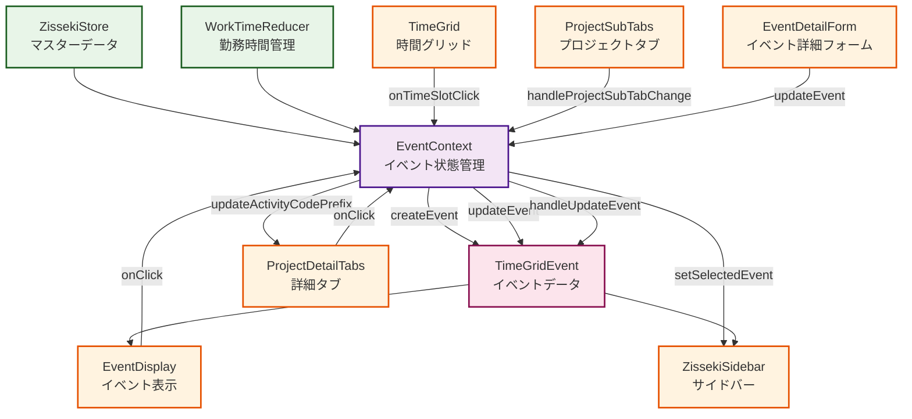
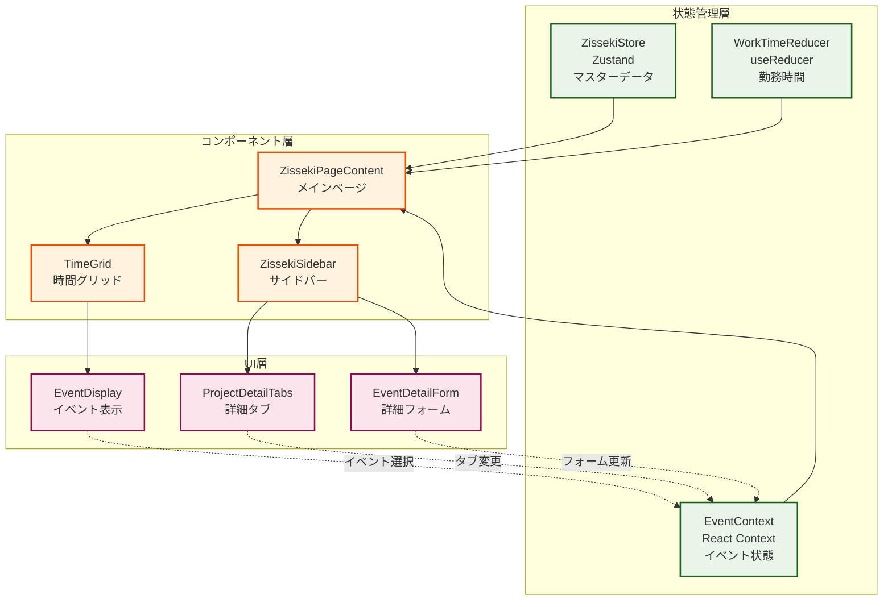
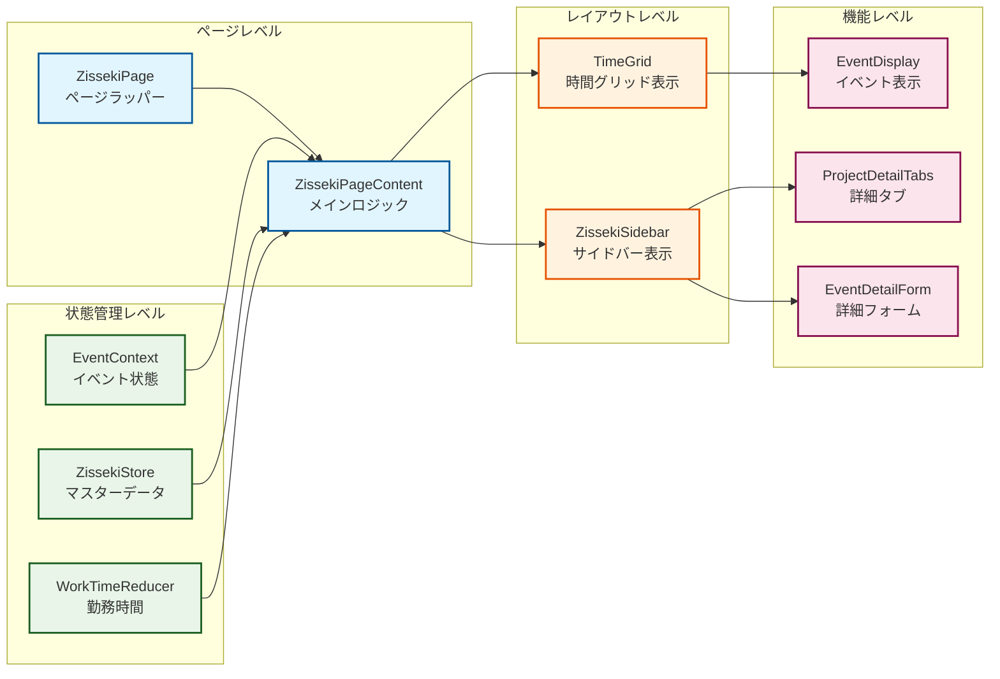
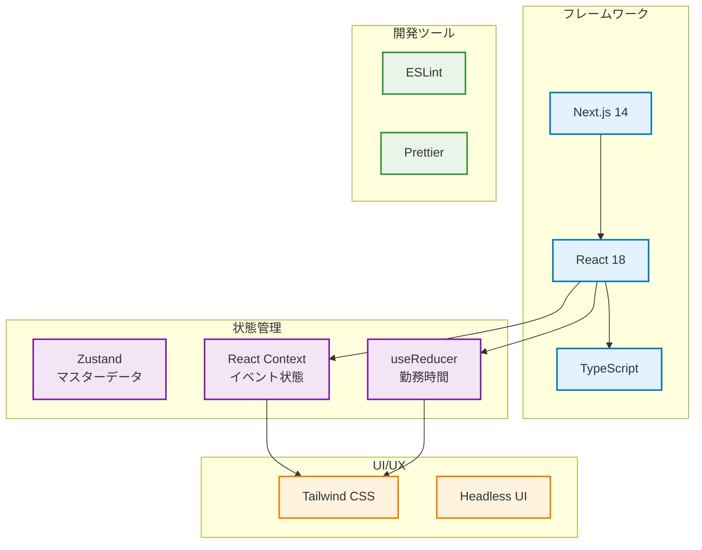

# Zisseki Demo アーキテクチャ図 - 簡略版

## 📊 コンポーネント階層図



## 🔄 データフロー図



## 🏗️ 状態管理アーキテクチャ



## 🎯 コンポーネント責任分担



## 🔧 技術スタック



## 📁 ファイル構造（簡略版）

```
zisseki-demo/[year]/[week]/
├── page.tsx                          # メインページ
├── components/
│   ├── sidebar/                      # サイドバー関連
│   │   ├── ZissekiSidebar.tsx       # メインサイドバー
│   │   ├── components/               # サイドバーコンポーネント
│   │   ├── selectors/                # セレクター
│   │   ├── tabs/                     # タブ関連
│   │   └── forms/                    # フォーム
│   ├── weekgrid/                     # 時間グリッド関連
│   │   ├── TimeGrid.tsx              # メイングリッド
│   │   └── components/               # グリッドコンポーネント
│   ├── ErrorDisplay.tsx              # エラー表示
│   └── loadingspinner.tsx            # ローディング
├── context/
│   └── EventContext.tsx              # イベント状態管理
├── store/
│   └── zissekiStore.ts               # Zustandストア
├── hooks/
│   └── reducer/
│       └── useWorkTimeReducer.ts     # 勤務時間管理
├── types/
│   └── index.ts                      # 型定義
└── constants/
    └── index.ts                      # 定数定義
```

## 🎯 主要な設計パターン

### 1. 状態管理の階層化
- **Zustand**: マスターデータ（プロジェクト、従業員、ユーザー）
- **React Context**: イベント状態（選択、作成、更新）
- **useReducer**: 勤務時間管理（開始・終了時間）

### 2. コンポーネントの責任分離
- **ページレベル**: 全体のレイアウトと状態管理の統合
- **レイアウトレベル**: 時間グリッドとサイドバーの表示
- **機能レベル**: 具体的なUI機能（タブ、フォーム、表示）

### 3. データフローの一方向性
- 状態管理 → コンポーネント → UI
- ユーザー操作 → イベントハンドラー → 状態更新

### 4. 条件付きレンダリング
- タブ選択に応じたコンポーネントの表示/非表示
- イベント選択状態に応じたUIの変化

## 🔮 将来の拡張ポイント

1. **新しいタブの追加**: 既存のタブ構造を拡張
2. **状態管理の最適化**: パフォーマンス向上のための状態分割
3. **リアルタイム同期**: WebSocket等によるリアルタイム更新
4. **オフライン対応**: Service Worker等によるオフライン機能
5. **国際化**: i18n対応による多言語化


